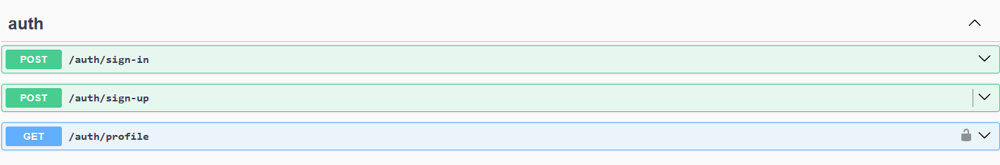
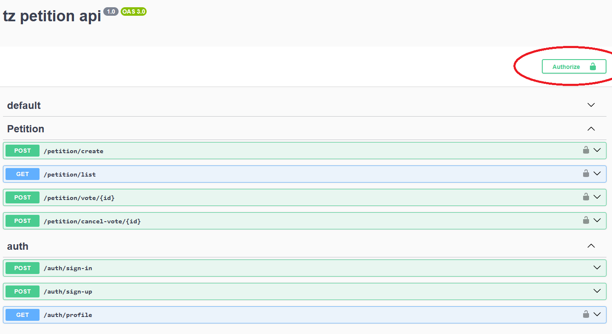
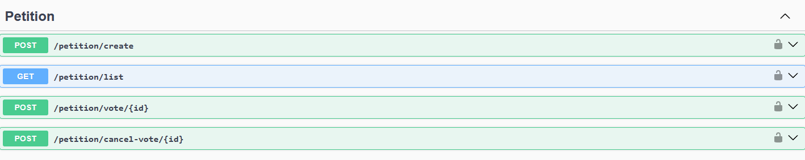

<p align="center">
  <a href="http://nestjs.com/" target="blank"></a>
</p>

[circleci-image]: https://img.shields.io/circleci/build/github/nestjs/nest/master?token=abc123def456
[circleci-url]: https://circleci.com/gh/nestjs/nest

# Petition Api

Test task with simple db entities. Petition Api

1. User authorization occurs via JWT
2. 1 user can add no more than 1 vote per petition
3. Each user can remove his own vote, but not someone else’s
4. Create Petition can anyone

## Prerequisites

-   docker engine

## Installation

-   Copy this repository
-   Run this command

```bash
docker-compose up
# ports 3000, 5432 must be open
```

-   open the swagger page http://localhost:3000/docs

## Testing Api

> There is swagger for http requests

#### Auth



-   sing-in, sign-up
-   > return access and refresh tokens
-   authorize using Jwt token
-   > 

#### Petition



-   Petition actions
